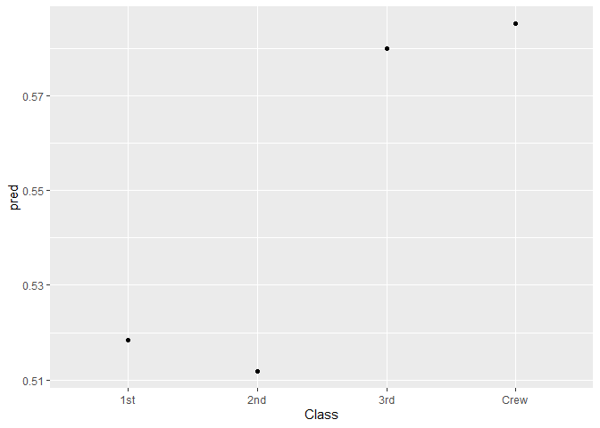

LogisticRegression
================

Logistic Regression i. P = e^(β0 + β1X+ εi)/e^(β0 + β1X+ εi) +1. ii.
log(p/(1-p)) = β0 + β1X+ εi. iii. log(p/(1-p)) is called the odds of
probability. It is the probability of desired outcome being true divided
by the probability of desired outcome not being true and this is called
a logit function.

``` r
Titanic_df<-data.frame(Titanic)
Titanic_df$Class<-as.factor(Titanic_df$Class)
regre<-glm(Survived~Class+Age+Sex+Freq,data=Titanic_df, family="binomial")
summary(regre)
```

    ## 
    ## Call:
    ## glm(formula = Survived ~ Class + Age + Sex + Freq, family = "binomial", 
    ##     data = Titanic_df)
    ## 
    ## Deviance Residuals: 
    ##    Min      1Q  Median      3Q     Max  
    ## -1.441  -1.207   0.284   1.154   1.361  
    ## 
    ## Coefficients:
    ##              Estimate Std. Error z value Pr(>|z|)
    ## (Intercept)  0.098003   0.876538   0.112    0.911
    ## Class2nd    -0.025657   1.010354  -0.025    0.980
    ## Class3rd     0.249314   1.037126   0.240    0.810
    ## ClassCrew    0.270842   1.045368   0.259    0.796
    ## AgeAdult     0.618150   0.868618   0.712    0.477
    ## SexFemale   -0.368374   0.768740  -0.479    0.632
    ## Freq        -0.005490   0.004925  -1.115    0.265
    ## 
    ## (Dispersion parameter for binomial family taken to be 1)
    ## 
    ##     Null deviance: 44.361  on 31  degrees of freedom
    ## Residual deviance: 42.506  on 25  degrees of freedom
    ## AIC: 56.506
    ## 
    ## Number of Fisher Scoring iterations: 4

``` r
Y<-data.frame("Crew","Adult","Female",as.numeric("50"))

Y[2,]<-data.frame("1st","Adult","Female",as.numeric("50"))

Y[3,]<-data.frame("2nd","Adult","Female",as.numeric("50"))

Y[4,]<-data.frame("3rd","Adult","Female",as.numeric("50"))

names(Y)<-c("Class","Age","Sex","Freq")

Y$pred<-predict(regre,Y, type="response")
ggplot( Y, aes(x=Class, y=pred)) +
  geom_point() 
```

<!-- -->

Note that the `echo = FALSE` parameter was added to the code chunk to
prevent printing of the R code that generated the plot.
